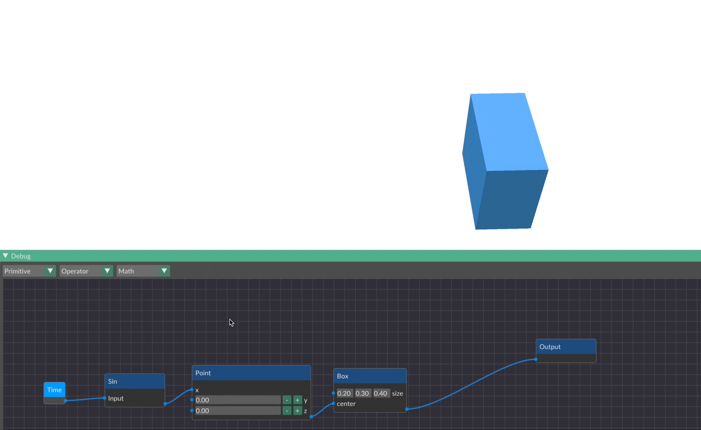

# Raumkünstler

Raumkünstler is a little side project I have been working on to tinker with implicit modelling. It's a playground for those who enjoy experimenting with shapes and forms through code.


### Key Features

- **Node-Based Modeling**: Play around with a visual scripting language where everything is node-based.
- **Implicit Modeling Approach**: Instead of an explicit boundary representation Raumkünstler describes shapes implicitly using formulas.
- **LLVM-Powered JIT Compilation**: We use LLVM to turn our node graph into a native function for blazing fast performance.
- **Fast Dual Contouring Implementation**: Raumkünstler implements a fast dual contouring implementation with empty space skipping and support for sharp features.

## Getting Started

Setting up Raumkünstler is pretty straightforward. You just need LLVM on your system.

### Prerequisites

- Make sure LLVM is installed – it's crucial for the build process.

### Installation

1. Grab the code:
   ```bash
   git clone https://github.com/elisabeth96/Raumkuenstler.git
   ```
2. Jump into the directory:
   ```bash
   cd Raumkuenstler
   ```
3. Build it:
   ```bash
   cmake -B build
   cmake --build build
   ```